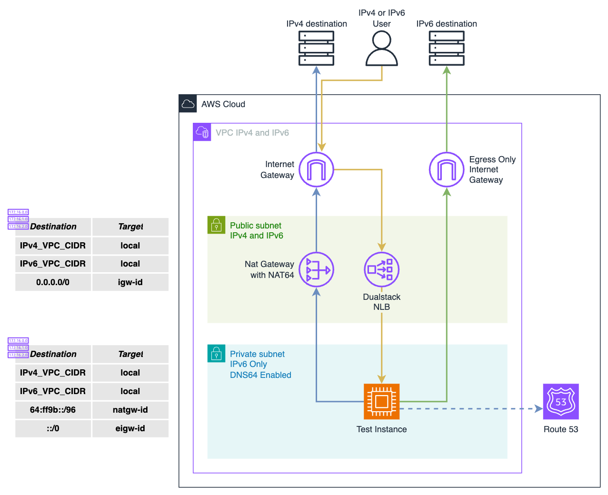

# AWS IPv6 Demo

This repository provides a sample architecture to demonstrate the use of IPv6 in AWS. It deploys a simple dual stack VPC consisting of two subnets, a public subnet with both IPv4 and IPv6 CIDRs and a private IPv6 only subnet. The architecture also provides Internet Gateway and Egress only Internet Gateway, a NAT gateway to perform NAT64 and a small ec2 instance deployed in the private subnet to demonstrate access to IPv6 and IPv4 targets from a IPv6 only instance. The ec2 instance is also frontend by a dualstack NLB to demonstrate access to an IPv6 only instance from IPv6 or IPv4 sources.

## License
This project is licensed under the [MIT License](LICENSE).