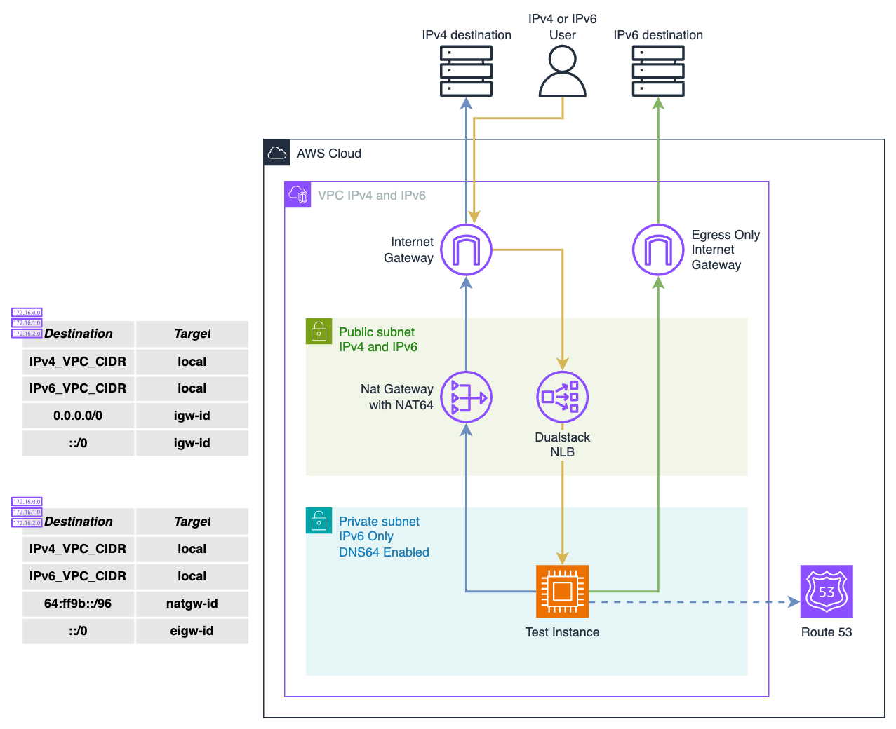

# AWS IPv6 Demo

This repository provides a sample architecture to demonstrate the use of IPv6 in AWS. It deploys a simple dual stack VPC consisting of two subnets, a public subnet with both IPv4 and IPv6 CIDRs and a private IPv6 only subnet. The architecture also provides Internet Gateway and Egress only Internet Gateway, a NAT gateway to perform NAT64 and a small ec2 instance deployed in the private subnet to demonstrate access to IPv6 and IPv4 targets from an IPv6 only instance. The ec2 instance is also frontend by a dual stack NLB to demonstrate access to an IPv6 only instance from IPv6 or IPv4 sources.



For the sake of simplicity and cost reduction, this architecture makes use of only one availability zone.

## Deployment

This Demo comes preconfigured with the IPv4 CIDR `10.10.10.0/24`. If you wish to change this CICDR, edit the `vpc_cidr` variable in the file `params.auto.tfvars`.

To deploy this demo first intialize terraform.

```
terraform init
```

An then perform a deploy.

```
terraform apply
```

> NOTE: although they are minimal, this deployment creates resources that generate costs. To avoid any surprise at the end of the month, consider to delete the resources deployed once finished with the demo.

To delete the resources deployed in this demo.

```
terraform destroy
```

## License
This project is licensed under the [MIT License](LICENSE).